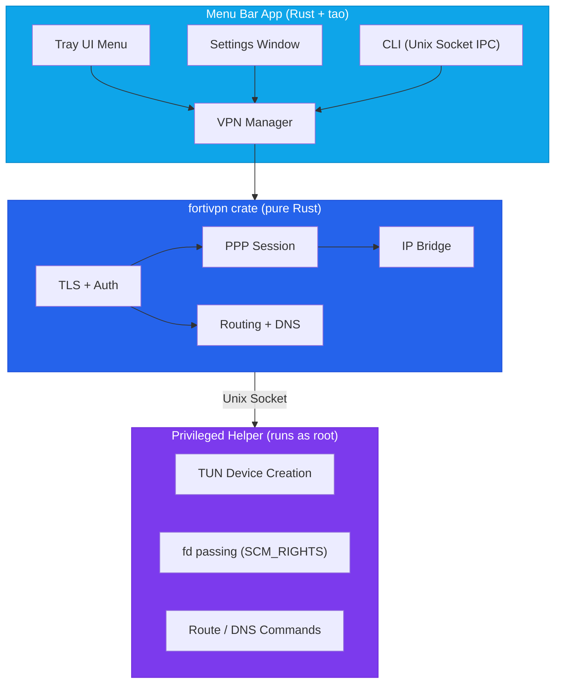

<p align="center">
  
</p>

<h1 align="center">FortiVPN Tray</h1>

<p align="center">
  A lightweight system tray app for FortiGate SSL-VPN — built natively in Rust.
</p>

<p align="center">
  
  

  
</p>

---

## Motivation

Connecting to a FortiGate SSL-VPN usually means either running the heavy FortiClient app or wrestling with `openfortivpn` in the terminal with `sudo`. Both have friction:

- **FortiClient** is bloated, installs kernel extensions, and runs background services you don't need.
- **openfortivpn** requires `sudo` for every connection, a config file, and terminal babysitting.

FortiVPN Tray takes a different approach — a **lightweight system tray app** that implements the FortiGate SSL-VPN protocol natively in Rust. No subprocess wrapping, no kernel extensions, no bloat. Just click to connect.

## Design

### Architecture



### Key Design Decisions

- **Native Rust protocol implementation** — TLS, HTTP auth, PPP framing, and IP bridging are all implemented from scratch. No dependency on `openfortivpn` or any external VPN binary.

- **Privilege separation** — Only the helper process runs with elevated privileges. It creates the TUN device and passes the file descriptor back over a Unix socket using `SCM_RIGHTS`. The main app stays unprivileged.

- **Persistent helper** — The privileged helper stays alive across connect/disconnect cycles. You only enter your password once per session, not on every connection.

- **IPv6 leak prevention** — Automatically disables IPv6 on active interfaces when the VPN connects to prevent traffic leaking outside the tunnel, and restores it on disconnect.

- **Secure credential storage** — VPN passwords are stored in the OS credential store (macOS Keychain, Windows Credential Manager, Linux Secret Service), never on disk.

### Workspace Structure

```
src/
├── src/                      # Tauri app (tray menu, IPC, profiles)
├── crates/
│   ├── fortivpn/             # Core VPN library (protocol, auth, tunneling)
│   ├── fortivpn-helper/      # Privileged helper binary (TUN + routing)
│   └── fortivpn-cli/         # CLI companion tool
src/                          # Frontend (settings UI)
```

## Features

- One-click connect/disconnect from the system tray
- macOS support (Windows and Linux planned)
- Multiple VPN profile support
- CLI companion for terminal workflows
- Secure credential storage (OS keychain/credential manager)
- Native desktop notifications
- IPv6 leak prevention
- Settings UI for managing profiles
- No external VPN binaries required

## Prerequisites

- [Rust toolchain](https://rustup.rs/)
- [Tauri CLI](https://tauri.app/start/create-project/)
- Platform-specific dependencies: see [Tauri prerequisites](https://v2.tauri.app/start/prerequisites/)

```bash
curl --proto '=https' --tlsv1.2 -sSf https://sh.rustup.rs | sh
cargo install create-tauri-app
```

## Build

```bash
cd src
cargo build --release
```

This produces:
- `target/release/fortivpn-tray` — the tray app
- `target/release/fortivpn` — the CLI companion

## Usage

### System Tray

1. Launch `fortivpn-tray`
2. Click the shield icon in the system tray
3. Open **Settings** to add a VPN profile (host, port, username, certificate fingerprint)
4. Click a profile to connect — the helper will prompt for your admin password on first connection
5. Click again to disconnect

### CLI

The CLI controls the VPN through the tray app via a Unix socket.

```bash
fortivpn status              # Show connection status
fortivpn list                # List profiles
fortivpn connect <name>      # Connect to a profile
fortivpn disconnect          # Disconnect
```

Short aliases: `s` = status, `l` = list, `c` = connect, `d` = disconnect

Profile matching is case-insensitive and partial — `sg` matches "My SG VPN".

> The tray app must be running for the CLI to work.

## Data Storage

| Data | Location |
|------|----------|
| Profiles | OS app data directory (`profiles.json`) |
| Passwords | OS credential store (Keychain / Credential Manager / Secret Service) |
| IPC Socket | `~/.config/fortivpn-tray/ipc.sock` |

## How It Works

1. **Authentication** — Connects to the FortiGate gateway over TLS, authenticates via HTTP POST, and obtains an `SVPNCOOKIE`.
2. **Tunnel setup** — The privileged helper creates a TUN device and passes the file descriptor to the main app via `SCM_RIGHTS`.
3. **PPP session** — Establishes a PPP session over the TLS connection to negotiate IP configuration.
4. **IP bridge** — Bridges packets between the TUN device and the PPP/TLS tunnel using async I/O.
5. **Routing** — Configures routes and DNS through the helper process, disables IPv6 to prevent leaks.
6. **Disconnect** — Tears down routes/DNS, restores IPv6, and closes the TLS session. The helper stays alive for the next connection.

## License

MIT
