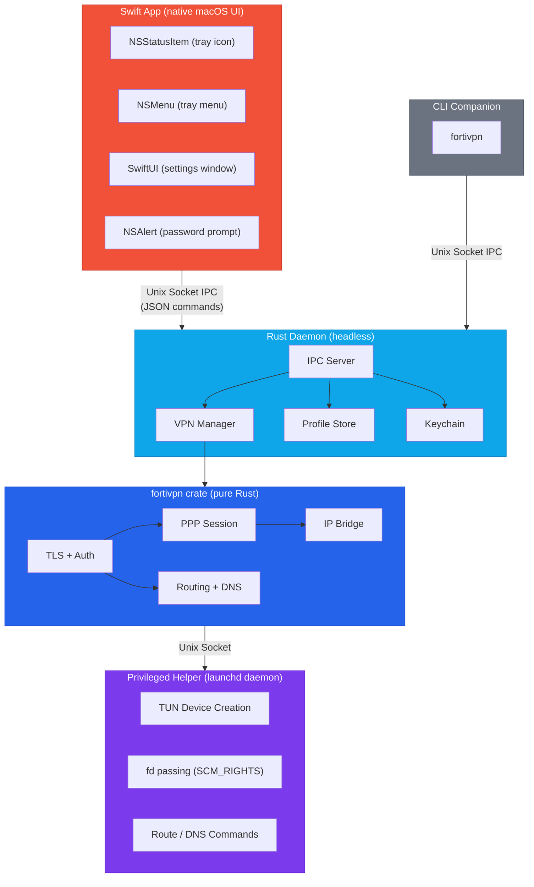
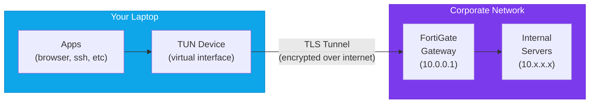
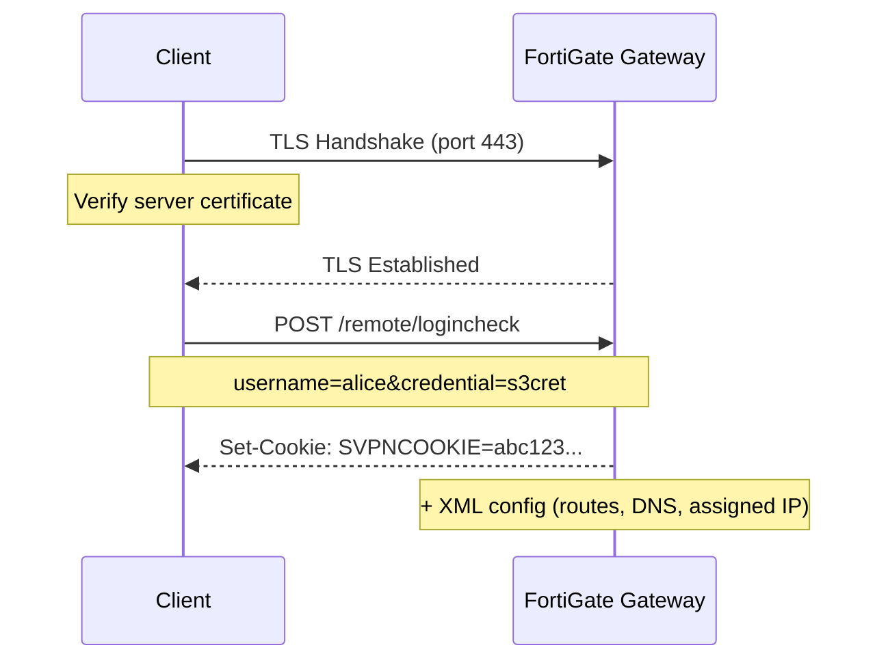
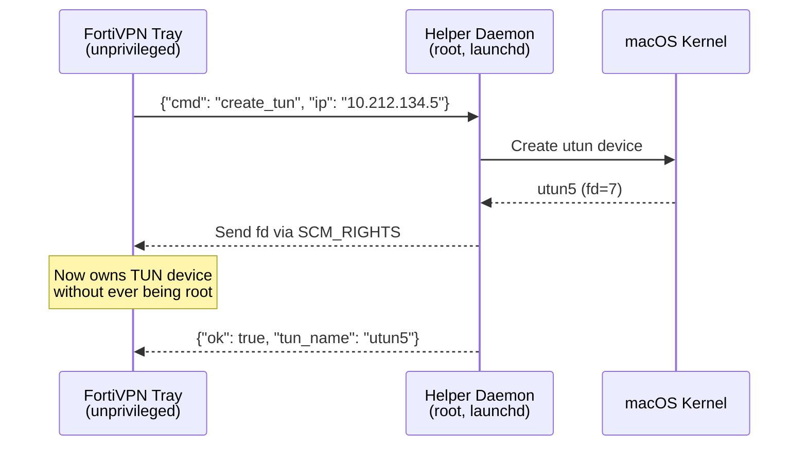
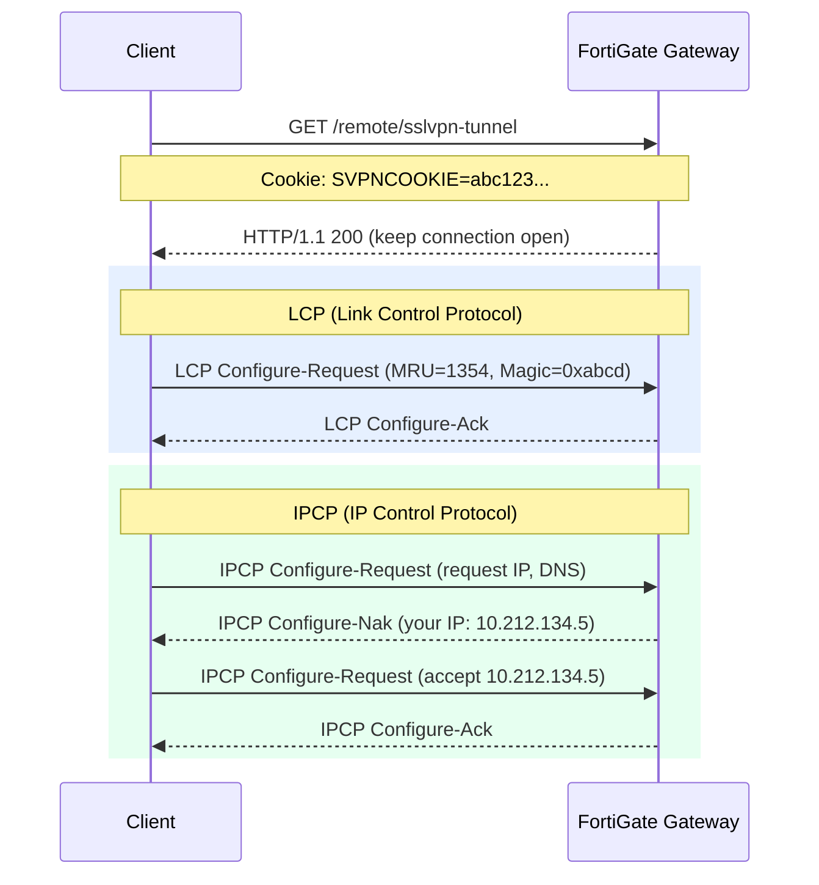
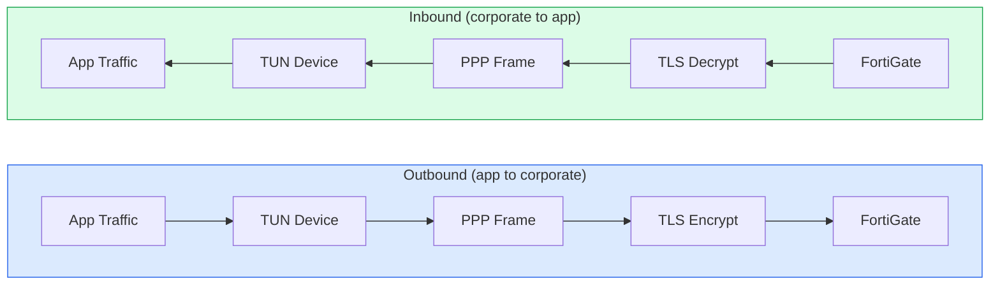
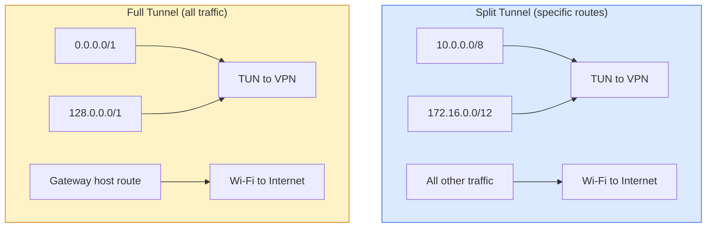
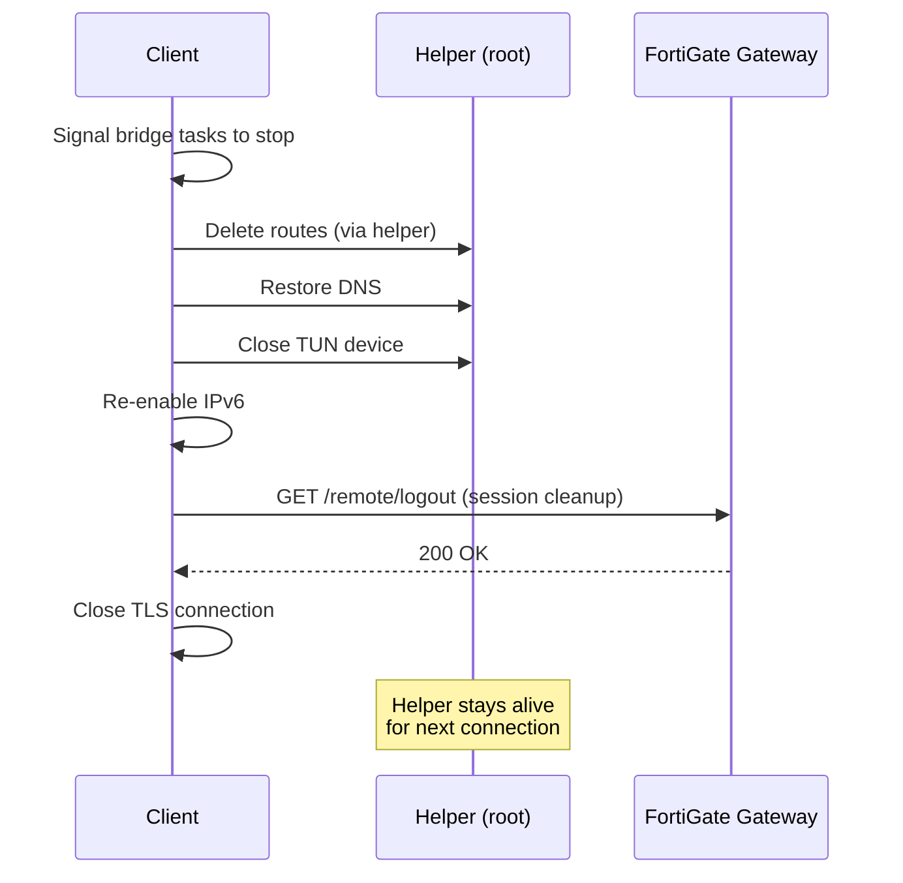

<p align="center">
  
</p>

<h1 align="center">FortiVPN Tray</h1>

<p align="center">
  A lightweight system tray app for FortiGate SSL-VPN with password storage and CLI automation — built with Swift and Rust.
</p>

<p align="center">
  
  
  
  <a href="https://securityscorecards.dev/viewer/?uri=github.com/ktutnik/fortivpn-tray"></a>
  
</p>

---

## Motivation

Connecting to a FortiGate SSL-VPN has three common options — all with significant friction:

- **FortiClient** doesn't store your VPN password. Every single connection requires manually typing your credentials. It's also bloated, installs kernel extensions, and runs background services you don't need.
- **openfortivpn** requires `sudo` for every connection, a config file, and terminal babysitting. No GUI, no password storage.
- **AI coding assistants** (Claude Code, Cursor, GitHub Copilot) that need VPN access to reach internal resources have no way to connect, disconnect, or check VPN status through FortiClient — there's no CLI, no API, no automation interface. You have to manually switch back to FortiClient every time the VPN drops.

FortiVPN Tray solves all three problems:

- **Stores your password securely** in the OS credential store (macOS Keychain, Windows Credential Manager, Linux Secret Service) — enter it once, connect forever
- **CLI companion** (`fortivpn connect sg`) lets AI coding assistants and scripts manage VPN connections programmatically
- **Lightweight system tray app** with near-zero battery impact — no kernel extensions, no bloat, just click to connect

## Features

- **Password storage** — enter your VPN password once, stored securely in OS keychain
- **CLI for automation** — `fortivpn connect/disconnect/status` for scripts and AI assistants
- One-click connect/disconnect from the system tray
- Near-zero battery drain when idle (no polling, no WebKit)
- Native settings UI with dark mode support
- Native password prompt on first connect
- Multiple VPN profile support
- Secure credential storage (macOS Keychain / Windows Credential Manager / Linux Secret Service)
- Native desktop notifications
- IPv6 leak prevention
- No external VPN binaries required

## Installation

### Why Build from Source?

A VPN app routes **all your network traffic** through its tunnel. You should know exactly what it does with that access. FortiVPN Tray is distributed as source code so you can audit it before trusting it.

- **Trust through transparency** — Every line of code is open for inspection. Unlike closed-source VPN clients, you can verify there's no telemetry, no data collection, no hidden network calls. Build it yourself and know exactly what's running.
- **No code signing costs** — Distributing signed binaries requires a paid Apple Developer Program ($99/year) on macOS, and an EV code signing certificate (~$300/year) on Windows. Without signing, OS gatekeepers block downloaded binaries. Building locally avoids this entirely — locally-built apps are trusted by default.
- **Reproducible** — Same source code, same build, same binary. Anyone can verify the build produces identical results.

### Prerequisites

All platforms need the [Rust toolchain](https://rustup.rs/):

```bash
curl --proto '=https' --tlsv1.2 -sSf https://sh.rustup.rs | sh
```

**Platform-specific requirements:**

| Platform | Additional Requirements |
|----------|----------------------|
| **macOS** | Xcode Command Line Tools: `xcode-select --install` |
| **Linux** | WebKitGTK + GTK3 + libappindicator (see below) |
| **Windows** | [Git for Windows](https://git-scm.com/download/win) (includes Git Bash), WebView2 (pre-installed on Win 10/11) |

<details>
<summary>Linux dependencies (click to expand)</summary>

**Ubuntu/Debian:**
```bash
sudo apt install libwebkit2gtk-4.1-dev libgtk-3-dev libayatana-appindicator3-dev
```

**Fedora:**
```bash
sudo dnf install webkit2gtk4.1-devel gtk3-devel libappindicator-gtk3-devel
```

**Arch:**
```bash
sudo pacman -S webkit2gtk-4.1 gtk3 libappindicator-gtk3
```
</details>

### Install

Clone the repo and run the install script. It auto-detects your platform:

```bash
git clone https://github.com/ktutnik/fortivpn-tray.git
cd fortivpn-tray
./install.sh
```

> **Windows**: Open **Git Bash** (installed with Git for Windows) and run the commands above. Do NOT use Command Prompt or PowerShell — the install script requires Bash.

The install script will:

| | macOS | Linux | Windows |
|---|---|---|---|
| **Builds** | Rust daemon + Swift UI | Rust daemon + Rust UI | Rust daemon + Rust UI |
| **Installs to** | `/Applications/` | `~/.local/bin/` | `%LOCALAPPDATA%\FortiVPN Tray\` |
| **Tray icon** | Native (Swift NSStatusItem) | tray-icon (libappindicator) | tray-icon (Win32) |
| **Settings UI** | SwiftUI (native) | WebView (WebKitGTK) | WebView (WebView2/Edge) |
| **Admin required** | Yes (one-time, for helper daemon) | No | No |

### Update

```bash
git pull
./install.sh
```

### Uninstall

```bash
./uninstall.sh
```

This will:
- Stop running processes
- Remove installed binaries and app bundle
- Remove helper daemon (macOS, requires admin password)
- Optionally remove profiles and config (asks for confirmation)

> **Windows**: Run `./uninstall.sh` in **Git Bash**. It will also remind you to remove any startup shortcuts manually.

<details>
<summary>Manual uninstall (without script)</summary>

**macOS:**
```bash
rm -rf "/Applications/FortiVPN Tray.app"
sudo launchctl bootout system /Library/LaunchDaemons/com.fortivpn-tray.helper.plist 2>/dev/null
sudo rm -f /Library/PrivilegedHelperTools/fortivpn-helper
sudo rm -f /Library/LaunchDaemons/com.fortivpn-tray.helper.plist
rm -rf ~/Library/Application\ Support/fortivpn-tray  # optional: removes profiles
```

**Linux:**
```bash
rm -f ~/.local/bin/fortivpn-{daemon,ui,helper} ~/.local/bin/fortivpn
rm -f ~/.local/share/applications/fortivpn-tray.desktop
rm -f ~/.config/autostart/fortivpn-tray.desktop
rm -rf ~/.config/fortivpn-tray  # optional: removes profiles
```

**Windows (Git Bash):**
```bash
rm -rf "$LOCALAPPDATA/FortiVPN Tray"
rm -rf "$APPDATA/fortivpn-tray"  # optional: removes profiles
```
</details>

## Usage

### System Tray

1. Launch **FortiVPN Tray** from Applications
2. Click the shield icon in the menu bar
3. Open **Settings** to add a VPN profile (host, port, username, certificate fingerprint)
4. Click a profile to connect — enter your VPN password when prompted
5. Click again to disconnect

### CLI

The CLI controls the VPN through the daemon via a Unix socket. This is what makes FortiVPN Tray automatable — AI coding assistants, scripts, and cron jobs can manage VPN connections programmatically.

```bash
fortivpn status              # Show connection status
fortivpn list                # List profiles
fortivpn connect <name>      # Connect to a profile
fortivpn disconnect          # Disconnect
```

Short aliases: `s` = status, `l` = list, `c` = connect, `d` = disconnect

Profile matching is case-insensitive and partial — `sg` matches "My SG VPN".

> The tray app must be running for the CLI to work.

### AI Coding Assistant Integration

AI coding assistants like Claude Code, Cursor, or GitHub Copilot can use the CLI to manage VPN connections when they need access to internal resources:

```bash
# Check if VPN is connected before accessing internal services
fortivpn status

# Connect to VPN when needed
fortivpn connect sg

# Disconnect when done
fortivpn disconnect
```

Since passwords are stored in the OS keychain, the CLI connects without any interactive prompts — perfect for automated workflows.

## Data Storage

| Data | Location |
|------|----------|
| Profiles | `~/Library/Application Support/fortivpn-tray/profiles.json` |
| Passwords | macOS Keychain (service: `fortivpn-tray`) |
| IPC Socket | `~/Library/Application Support/fortivpn-tray/ipc.sock` |

## Design

### Architecture Overview

The app follows the [Tailscale pattern](https://tailscale.com/) — separating the **UI** from the **VPN engine** into two processes that communicate over IPC.



**Why two processes?** Battery efficiency. A single process with both UI and VPN would need to run a GUI event loop constantly. By splitting them, the Swift UI app sleeps completely when idle (zero CPU), while the Rust daemon blocks on socket I/O (near-zero CPU). macOS distributed notifications (`CFNotificationCenter`) connect them instantly when state changes — no polling.

### The Four Components

#### 1. Swift UI App (`macos/FortiVPNTray/`)

The user-facing macOS app. Provides the tray icon, menu, settings window, and password prompt. Has **no VPN logic** — it's a thin controller that sends commands to the daemon.

| File | What it does |
|------|-------------|
| [`App.swift`](macos/FortiVPNTray/Sources/App.swift) | Entry point. Sets `NSApp.setActivationPolicy(.accessory)` to hide from Dock. |
| [`AppDelegate.swift`](macos/FortiVPNTray/Sources/AppDelegate.swift) | Tray icon (`NSStatusItem`), menu building (`NSMenuDelegate`), connect/disconnect actions, password prompt (`NSAlert`), auto-reconnect logic, macOS Keychain access. |
| [`DaemonClient.swift`](macos/FortiVPNTray/Sources/DaemonClient.swift) | Unix socket client. Opens a connection to the daemon, sends a text command, reads JSON response. Each command opens a fresh socket (stateless). |
| [`VPNState.swift`](macos/FortiVPNTray/Sources/VPNState.swift) | `ObservableObject` holding profiles and connection status. `refresh()` calls `DaemonClient` to fetch latest state. Checks Keychain for password status. |
| [`SettingsView.swift`](macos/FortiVPNTray/Sources/SettingsView.swift) | SwiftUI `NavigationSplitView` — sidebar with profile list, detail with edit form. |
| [`ProfileFormView.swift`](macos/FortiVPNTray/Sources/ProfileFormView.swift) | SwiftUI form for creating/editing profiles (name, host, port, username, cert fingerprint, password). |
| [`Models.swift`](macos/FortiVPNTray/Sources/Models.swift) | `Codable` structs matching the daemon's JSON: `VpnProfile`, `IpcResponse`, `StatusResponse`. |

**Key interaction**: When you click "Connect" in the tray menu, the Swift app reads the password from macOS Keychain (Swift has UI access, so no auth dialogs), then sends `connect_with_password {"name":"MIMS SG","password":"..."}` to the daemon via the Unix socket. The daemon handles the actual VPN connection.

**Status sync**: The daemon posts `CFNotificationCenter` distributed notifications when VPN state changes. The Swift app listens via `DistributedNotificationCenter.default().addObserver(...)` and instantly updates the tray icon — zero polling.

#### 2. Rust Daemon (`src/`)

A headless background process running a tokio async runtime. Owns all VPN logic, profile storage, and serves the IPC protocol.

| File | What it does |
|------|-------------|
| [`main.rs`](src/main.rs) | Entry point. Initializes logging (`os_log` on macOS, `env_logger` on Linux/Windows), loads profiles, checks helper installation, starts IPC server. |
| [`ipc.rs`](src/ipc.rs) | Unix socket server at `~/Library/Application Support/fortivpn-tray/ipc.sock`. Accepts connections, reads newline-delimited text commands, dispatches to handlers, returns JSON. Supports: `status`, `list`, `connect`, `disconnect`, `connect_with_password`, `get_profiles`, `save_profile`, `delete_profile`, `set_password`, `has_password`. |
| [`vpn.rs`](src/vpn.rs) | `VpnManager` — state machine tracking `Disconnected/Connecting/Connected/Disconnecting/Error`. Manages helper client, session passwords, and the connection lifecycle. |
| [`profile.rs`](src/profile.rs) | `ProfileStore` — loads/saves `profiles.json`. CRUD operations with auto-save. |
| [`keychain.rs`](src/keychain.rs) | Thin wrapper around `keyring` crate for password storage (macOS Keychain / Windows Credential Manager / Linux Secret Service). |
| [`notification.rs`](src/notification.rs) | Desktop notifications via `notify-rust`. Also posts macOS distributed notifications (spawns `/usr/bin/swift` to call `DistributedNotificationCenter` since tokio threads have no CFRunLoop). |
| [`installer.rs`](src/installer.rs) | One-time helper daemon installation. Copies binary to `/Library/PrivilegedHelperTools/`, loads plist via `launchctl`, prompts for admin password via `osascript`. |

**IPC Protocol**: Text-based, one command per line, one JSON response per line. Example:
```
→ status
← {"ok":true,"message":"ok","data":{"status":"connected","profile":"MIMS SG"}}

→ connect_with_password {"name":"MIMS SG","password":"secret"}
← {"ok":true,"message":"Connected"}

→ disconnect
← {"ok":true,"message":"Disconnected"}
```

#### 3. VPN Library (`crates/fortivpn/`)

The core VPN protocol implementation. Pure Rust, zero UI dependencies, fully cross-platform. This is where the actual FortiGate SSL-VPN protocol is implemented.

| File | What it does |
|------|-------------|
| [`lib.rs`](crates/fortivpn/src/lib.rs) | `VpnSession` — orchestrates the 6-phase connection: auth, tunnel, PPP, TUN, bridge, routing. `VpnEvent` watch channel for session death detection. |
| [`auth.rs`](crates/fortivpn/src/auth.rs) | TLS connection + HTTP POST authentication. Extracts `SVPNCOOKIE` and parses the XML configuration response. Optional SHA256 certificate pinning. |
| [`bridge.rs`](crates/fortivpn/src/bridge.rs) | Async IP bridge — two tokio tasks running concurrently: TUN-to-TLS and TLS-to-TUN. Handles PPP negotiation (LCP/IPCP) and LCP echo keep-alive. |
| [`tunnel.rs`](crates/fortivpn/src/tunnel.rs) | FortiGate proprietary framing: 6-byte header with magic number `0x5050` + payload length. Encode/decode frames. |
| [`ppp.rs`](crates/fortivpn/src/ppp.rs) | PPP packet encoding/decoding. LCP (link config, echo, terminate) and IPCP (IP assignment, DNS) state machines. |
| [`routing.rs`](crates/fortivpn/src/routing.rs) | Route/DNS configuration via helper. Split tunnel (specific routes) or full tunnel (`0.0.0.0/1` + `128.0.0.0/1`). IPv6 leak prevention. |
| [`helper.rs`](crates/fortivpn/src/helper.rs) | `HelperClient` — connects to the privileged helper daemon via Unix socket. Sends JSON commands for TUN creation, route/DNS management. Receives TUN file descriptor via `SCM_RIGHTS`. |
| [`tun.rs`](crates/fortivpn/src/tun.rs) | TUN device creation via `tun2` crate. |
| [`async_tun.rs`](crates/fortivpn/src/async_tun.rs) | `AsyncRead`/`AsyncWrite` wrapper for raw TUN fd using `tokio::io::unix::AsyncFd`. |

#### 4. Privileged Helper (`crates/fortivpn-helper/`)

A single-file binary ([`main.rs`](crates/fortivpn-helper/src/main.rs)) that runs as root via macOS `launchd`. It's the only component that needs elevated privileges.

**Why separate?** Creating TUN devices and modifying routes requires root. Instead of running the entire app as root, only this small, auditable binary runs privileged. It communicates with the daemon via a Unix socket at `/var/run/fortivpn-helper.sock`.

**Socket activation**: The helper is launched on-demand by `launchd` when something connects to its socket. It handles the request, then exits after 30 seconds of inactivity. launchd restarts it on the next connection.

**Commands**: `create_tun`, `destroy_tun`, `add_route`, `delete_route`, `configure_dns`, `restore_dns`, `ping`, `version`, `shutdown`.

#### 5. Cross-Platform UI (`crates/fortivpn-ui/`)

An alternative UI for Windows and Linux using Rust + `tray-icon`/`muda` + `wry` (WebView). Shares the same IPC protocol as the Swift app.

| File | What it does |
|------|-------------|
| [`main.rs`](crates/fortivpn-ui/src/main.rs) | `tao` event loop + tray icon + on-demand WebView for settings. |
| [`ipc_client.rs`](crates/fortivpn-ui/src/ipc_client.rs) | Unix socket IPC client (Rust equivalent of Swift's `DaemonClient`). |
| [`resources/settings.html`](crates/fortivpn-ui/resources/settings.html) | HTML/CSS/JS settings page with sidebar + form. |

### Key Design Decisions

- **Swift + Rust split** — Swift owns all macOS UI. Rust owns VPN logic and runs cross-platform. They communicate via Unix socket IPC. This gives native macOS UX (Dock behavior, Spaces, dark mode) with zero battery drain.

- **Native Rust protocol** — TLS, HTTP auth, PPP framing, IP bridging all implemented from scratch. No dependency on `openfortivpn` or any external binary.

- **Near-zero battery** — No polling. Swift app sleeps until you click the tray icon. Daemon blocks on `accept()`. Status changes propagate via macOS distributed notifications (kernel-level, zero-cost).

- **Privilege separation** — Only the helper runs as root. Main app and daemon are unprivileged. Helper is socket-activated by launchd (starts on demand, exits after idle).

- **Auto-reconnect** — When VPN drops unexpectedly (error status), the Swift app automatically retries up to 3 times with 3-second delays. Manual disconnects don't trigger reconnect.

- **Credential isolation** — On macOS, only the Swift app accesses the Keychain (it has UI access for auth dialogs). The daemon never touches the Keychain — passwords are passed via IPC. This avoids macOS Secure Keyboard Entry blocking issues.

### Project Structure

```
fortivpn-tray/
├── macos/FortiVPNTray/           # Swift macOS app (UI only)
│   ├── Sources/
│   │   ├── App.swift             # Entry point
│   │   ├── AppDelegate.swift     # Tray, menu, connect/disconnect, keychain
│   │   ├── VPNState.swift        # Observable state
│   │   ├── DaemonClient.swift    # IPC client (Unix socket)
│   │   ├── SettingsView.swift    # SwiftUI settings
│   │   ├── ProfileFormView.swift # Profile edit form
│   │   └── Models.swift          # JSON models
│   └── Package.swift
├── src/                           # Rust daemon (VPN engine)
│   ├── main.rs                   # Daemon entry point
│   ├── ipc.rs                    # IPC server + command handlers
│   ├── vpn.rs                    # VPN state machine
│   ├── profile.rs                # Profile storage (JSON)
│   ├── keychain.rs               # OS credential store
│   ├── notification.rs           # Notifications + distributed events
│   └── installer.rs              # Helper installation
├── crates/
│   ├── fortivpn/                 # VPN protocol library (cross-platform)
│   │   └── src/
│   │       ├── lib.rs            # VpnSession orchestration
│   │       ├── auth.rs           # TLS + HTTP authentication
│   │       ├── bridge.rs         # Async IP bridge (TUN to TLS)
│   │       ├── tunnel.rs         # FortiGate frame encoding
│   │       ├── ppp.rs            # PPP/LCP/IPCP protocol
│   │       ├── routing.rs        # Route + DNS management
│   │       ├── helper.rs         # Helper client (SCM_RIGHTS)
│   │       ├── tun.rs            # TUN device creation
│   │       └── async_tun.rs      # Async TUN wrapper
│   ├── fortivpn-helper/          # Privileged helper (runs as root)
│   │   └── src/main.rs           # launchd socket-activated daemon
│   ├── fortivpn-cli/             # CLI companion
│   │   └── src/main.rs           # fortivpn connect/disconnect/status
│   └── fortivpn-ui/              # Cross-platform UI (Windows/Linux)
│       ├── src/
│       │   ├── main.rs           # tray-icon + wry webview
│       │   └── ipc_client.rs     # IPC client (Rust)
│       └── resources/
│           └── settings.html     # HTML settings page
├── resources/
│   ├── Info.plist                # macOS app bundle metadata
│   └── com.fortivpn-tray.helper.plist  # launchd daemon config
├── tests/                         # Integration tests
├── icons/                         # App + tray icons
├── install.sh                     # Cross-platform install script
├── uninstall.sh                   # Cross-platform uninstall script
├── Cargo.toml                     # Rust workspace root
└── build.rs                       # Build script (helper binary)
```

### Running Tests

```bash
cargo test --workspace            # Run all 276 tests
cargo test -p fortivpn            # VPN protocol tests only
cargo clippy --workspace          # Lint
```

### Logging

Both processes log to macOS unified logging:

```bash
# Real-time log stream
log stream --predicate 'subsystem == "com.fortivpn-tray"' --level debug

# Search last hour
log show --predicate 'subsystem == "com.fortivpn-tray"' --last 1h

# Or open Console.app and search "com.fortivpn-tray"
```

On Linux/Windows, the daemon logs to stderr via `env_logger` (controlled by `RUST_LOG` env var).

## How FortiGate SSL-VPN Works

### What is FortiGate SSL-VPN?

FortiGate is a network security appliance made by Fortinet. Organizations deploy it at the edge of their corporate network as a firewall and VPN gateway. The **SSL-VPN** feature allows remote employees to securely access the internal corporate network over the internet using TLS (the same encryption that protects HTTPS websites).

Unlike IPsec VPNs which operate at the network layer and require special firewall rules, SSL-VPN runs over standard HTTPS (port 443 by default), making it work through almost any firewall or NAT — including hotel Wi-Fi, airport networks, and restrictive corporate proxies.

### The Big Picture



When connected, your laptop gets a **virtual IP address** on the corporate network (e.g., `10.212.134.5`). All traffic destined for the corporate network is routed through a **TUN device** (a virtual network interface), encrypted via TLS, and sent to the FortiGate gateway which decrypts it and forwards it to the internal servers. Responses travel the same path back.

### How the Client Connects (Step by Step)

FortiVPN Tray implements the full FortiGate SSL-VPN client protocol in Rust. Here's what happens when you click "Connect":

#### Phase 1: TLS Authentication



The client connects to the gateway over TLS, then authenticates via an HTTP POST request with username and password. On success, the gateway returns an `SVPNCOOKIE` (a session token) and an XML configuration containing:
- **Assigned IP address** — your virtual IP on the corporate network
- **Routes** — which IP ranges should go through the VPN (split tunnel) or all traffic (full tunnel)
- **DNS servers** — corporate DNS servers for resolving internal hostnames

#### Phase 2: TUN Device Creation

A **TUN device** (`utun`) is a virtual network interface that operates at the IP layer. When you send traffic to `10.x.x.x`, the OS routing table directs it to the TUN device instead of your physical Wi-Fi adapter. The VPN client reads these packets from the TUN device and sends them through the encrypted tunnel.

Creating a TUN device requires **root privileges**. FortiVPN Tray uses a separate privileged helper process (managed by macOS `launchd`) that creates the TUN device and passes the file descriptor back to the unprivileged main app using `SCM_RIGHTS` — a Unix mechanism for sending open file descriptors between processes.



#### Phase 3: PPP Negotiation



After authentication, a second TLS connection opens the actual VPN tunnel via HTTP. Inside this connection, FortiGate uses **PPP (Point-to-Point Protocol)** to negotiate:
- **LCP** (Link Control Protocol) — Agrees on maximum packet size and connection parameters
- **IPCP** (IP Control Protocol) — Assigns the client its virtual IP address and DNS servers

PPP frames are wrapped inside FortiGate's proprietary framing format (a 6-byte header with a magic number `0x5050` and payload length).

#### Phase 4: IP Bridge (Data Transfer)

Once PPP negotiation completes, the client runs an **async IP bridge** — two concurrent loops:



- **TUN to Tunnel**: Read raw IP packets from the TUN device, wrap them in PPP frames with FortiGate's header, encrypt via TLS, and send to the gateway.
- **Tunnel to TUN**: Read encrypted PPP frames from the TLS connection, unwrap the IP packets, and write them to the TUN device.

The bridge also handles **LCP Echo** keep-alive messages — the gateway sends periodic echo requests, and the client must reply to prove the connection is still alive. If 3 consecutive echoes go unanswered, the gateway drops the session.

#### Phase 5: Routing

With the tunnel running, the client configures the OS routing table so that traffic to corporate networks goes through the TUN device:



**Split tunnel** routes only corporate IP ranges through the VPN. All other traffic (web browsing, streaming) goes directly through your normal internet connection.

**Full tunnel** routes all IPv4 traffic through the VPN using two broad routes (`0.0.0.0/1` + `128.0.0.0/1`) that cover the entire address space without replacing the actual default route.

A **host route** to the gateway's public IP is always added via the original default gateway, so the encrypted tunnel traffic itself doesn't get routed back into the VPN (which would create a loop).

DNS is configured via macOS `scutil` to use the corporate DNS servers for resolving internal hostnames like `jira.corp.com` or `git.internal`.

#### Phase 6: Disconnect



The helper daemon stays alive for the next connection — no admin password prompt needed.

### Security Model

| Layer | Protection |
|-------|-----------|
| **Transport** | TLS 1.2/1.3 encrypts all tunnel traffic |
| **Authentication** | Username + password over TLS (no plaintext) |
| **Certificate pinning** | Optional SHA256 fingerprint verification prevents MITM |
| **Credential storage** | Passwords in macOS Keychain (hardware-backed on Apple Silicon) |
| **Privilege separation** | Main app is unprivileged; only the helper runs as root |
| **IPv6 leak prevention** | IPv6 disabled during VPN to prevent traffic bypassing the tunnel |

## License

MIT
