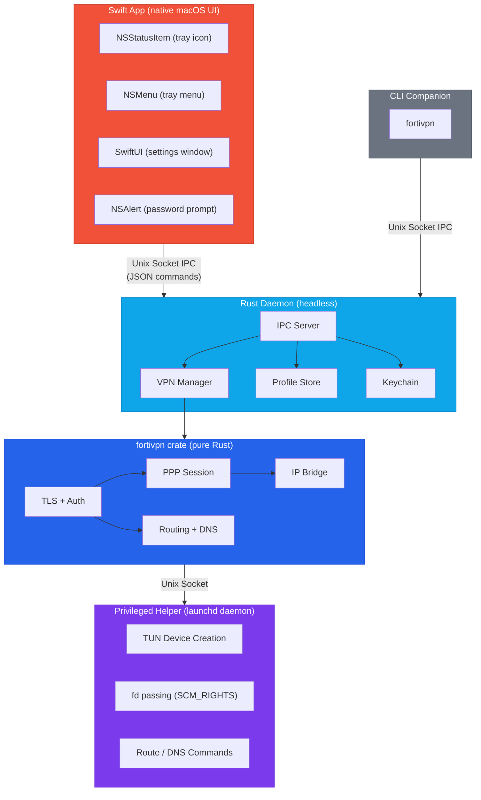
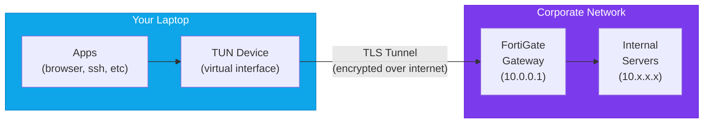
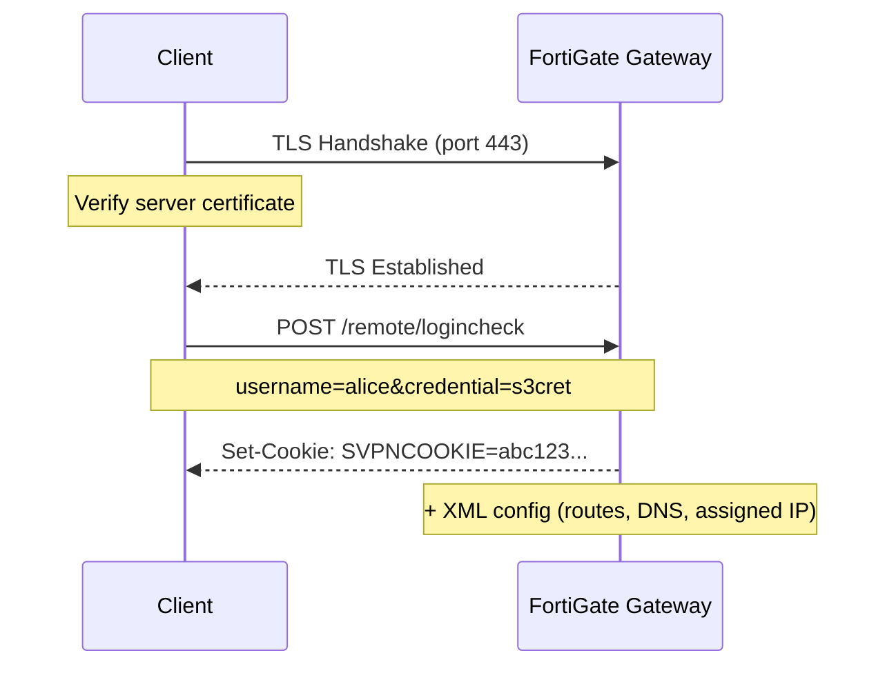
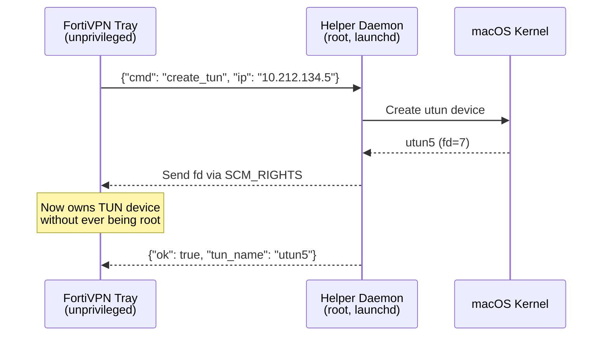
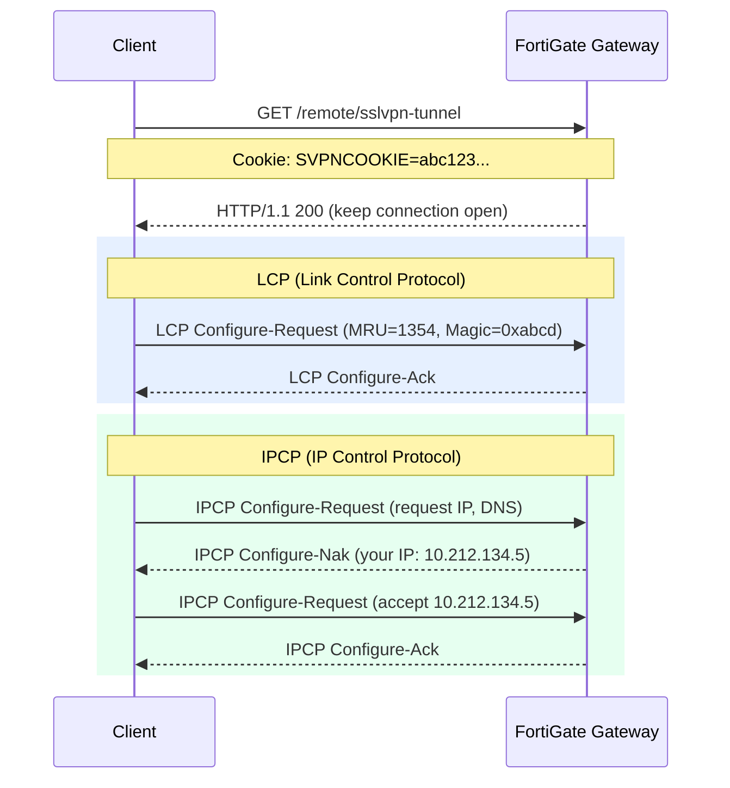
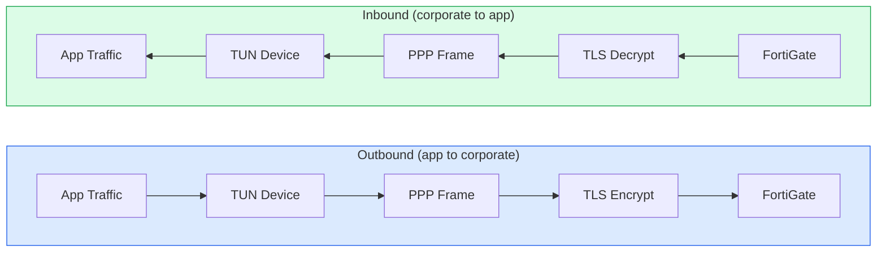
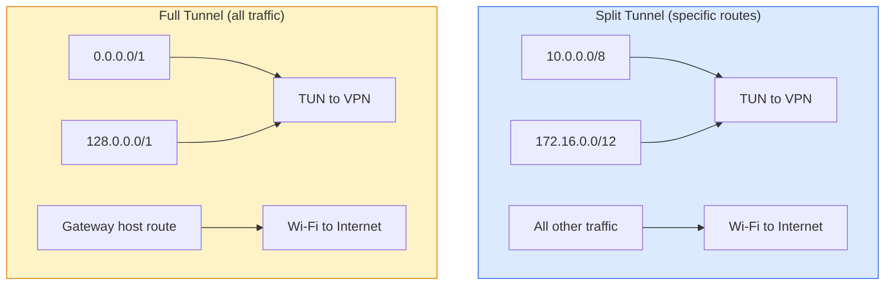
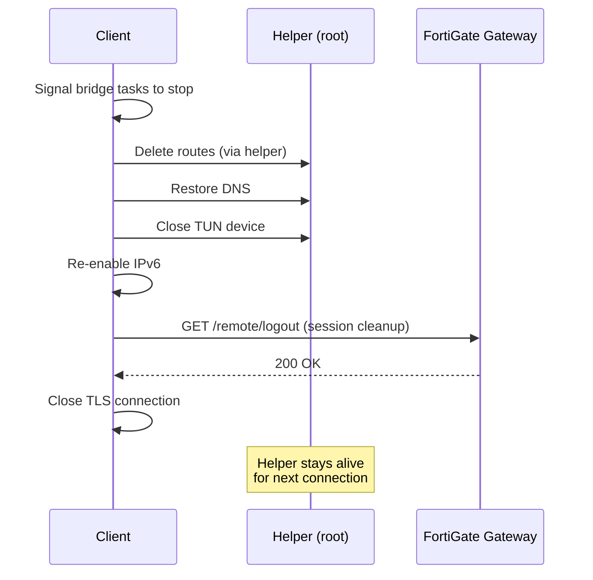

<p align="center">
  
</p>

<h1 align="center">FortiVPN Tray</h1>

<p align="center">
  A lightweight macOS system tray app for FortiGate SSL-VPN — built with Swift and Rust.
</p>

<p align="center">
  
  
  
  
</p>

---

## Motivation

Connecting to a FortiGate SSL-VPN usually means either running the heavy FortiClient app or wrestling with `openfortivpn` in the terminal with `sudo`. Both have friction:

- **FortiClient** is bloated, installs kernel extensions, and runs background services you don't need.
- **openfortivpn** requires `sudo` for every connection, a config file, and terminal babysitting.

FortiVPN Tray takes a different approach — a **lightweight system tray app** that implements the FortiGate SSL-VPN protocol natively in Rust. No subprocess wrapping, no kernel extensions, no bloat. Just click to connect.

## Design

### Architecture

The app follows the **Tailscale pattern** — a native Swift UI app communicating with a Rust daemon over a Unix socket.



### Key Design Decisions

- **Swift + Rust split** — Swift owns all UI (tray icon, menu, settings window, password prompt). Rust runs as a headless daemon handling VPN protocol, profile storage, keychain access, and IPC. They communicate over a Unix domain socket using JSON commands.

- **Native Rust protocol implementation** — TLS, HTTP auth, PPP framing, and IP bridging are all implemented from scratch. No dependency on `openfortivpn` or any external VPN binary.

- **Near-zero battery drain** — No polling, no WebKit, no background timers. The Swift app sleeps completely when idle. The Rust daemon blocks on socket `accept()`. State refreshes only when you interact with the tray menu.

- **Privilege separation** — Only the helper process runs with elevated privileges (as a launchd daemon). It creates the TUN device and passes the file descriptor back via `SCM_RIGHTS`. The main app stays unprivileged.

- **Persistent helper** — The privileged helper is managed by launchd with socket activation. No repeated admin password prompts — install once, connect forever.

- **IPv6 leak prevention** — Automatically disables IPv6 on active interfaces when the VPN connects to prevent traffic leaking outside the tunnel, and restores it on disconnect.

- **Secure credential storage** — VPN passwords are stored in macOS Keychain, never on disk.

### Project Structure

```
fortivpn-tray/
├── macos/FortiVPNTray/          # Swift macOS app
│   ├── Sources/
│   │   ├── App.swift            # @main entry point
│   │   ├── AppDelegate.swift    # NSStatusItem, NSMenu, tray icon
│   │   ├── VPNState.swift       # Observable state (profiles, status)
│   │   ├── DaemonClient.swift   # Unix socket IPC client
│   │   ├── SettingsView.swift   # SwiftUI settings window
│   │   ├── ProfileFormView.swift # SwiftUI profile edit form
│   │   └── Models.swift         # Codable data models
│   └── Package.swift
├── src/                          # Rust daemon
│   ├── main.rs                  # Daemon entry point (tokio runtime)
│   ├── ipc.rs                   # Unix socket IPC server + command handlers
│   ├── vpn.rs                   # VPN connection lifecycle
│   ├── profile.rs               # Profile CRUD, JSON persistence
│   ├── keychain.rs              # macOS Keychain read/write/delete
│   ├── installer.rs             # Helper daemon installation
│   └── notification.rs          # Desktop notifications
├── crates/
│   ├── fortivpn/                # Core VPN library (protocol, auth, tunneling)
│   ├── fortivpn-helper/         # Privileged helper binary (TUN + routing)
│   └── fortivpn-cli/            # CLI companion tool
├── resources/
│   ├── Info.plist               # macOS app bundle metadata
│   └── com.fortivpn-tray.helper.plist  # launchd daemon config
├── scripts/
│   └── bundle-app.sh            # Build + assemble .app bundle
├── icons/                        # App and tray icons
├── Cargo.toml                    # Rust workspace root
└── build.rs                      # Build script (helper binary)
```

## Features

- One-click connect/disconnect from the system tray
- Near-zero battery drain when idle (no polling, no WebKit)
- Native SwiftUI settings with dark mode support
- Native password prompt on first connect
- Multiple VPN profile support
- CLI companion for terminal workflows
- Secure credential storage (macOS Keychain)
- Native desktop notifications
- IPv6 leak prevention
- No external VPN binaries required

## Prerequisites

- [Rust toolchain](https://rustup.rs/)
- Xcode Command Line Tools (for Swift)

```bash
curl --proto '=https' --tlsv1.2 -sSf https://sh.rustup.rs | sh
xcode-select --install
```

## Build

```bash
bash scripts/bundle-app.sh
```

This builds both the Rust daemon and Swift app, then assembles them into a macOS `.app` bundle:
- `target/release/bundle/FortiVPN Tray.app` — the macOS app bundle
- `target/release/fortivpn` — the CLI companion

### Install

```bash
# Copy app to Applications
cp -r "target/release/bundle/FortiVPN Tray.app" /Applications/

# Install privileged helper daemon
sudo bash -c '
cp target/release/fortivpn-helper /Library/PrivilegedHelperTools/fortivpn-helper &&
chmod 755 /Library/PrivilegedHelperTools/fortivpn-helper &&
chown root:wheel /Library/PrivilegedHelperTools/fortivpn-helper &&
cp resources/com.fortivpn-tray.helper.plist /Library/LaunchDaemons/ &&
chown root:wheel /Library/LaunchDaemons/com.fortivpn-tray.helper.plist &&
launchctl bootout system /Library/LaunchDaemons/com.fortivpn-tray.helper.plist 2>/dev/null;
launchctl bootstrap system /Library/LaunchDaemons/com.fortivpn-tray.helper.plist
'
```

## Usage

### System Tray

1. Launch **FortiVPN Tray** from Applications
2. Click the shield icon in the menu bar
3. Open **Settings** to add a VPN profile (host, port, username, certificate fingerprint)
4. Click a profile to connect — enter your VPN password when prompted
5. Click again to disconnect

### CLI

The CLI controls the VPN through the daemon via a Unix socket.

```bash
fortivpn status              # Show connection status
fortivpn list                # List profiles
fortivpn connect <name>      # Connect to a profile
fortivpn disconnect          # Disconnect
```

Short aliases: `s` = status, `l` = list, `c` = connect, `d` = disconnect

Profile matching is case-insensitive and partial — `sg` matches "My SG VPN".

> The tray app must be running for the CLI to work.

## Data Storage

| Data | Location |
|------|----------|
| Profiles | `~/Library/Application Support/fortivpn-tray/profiles.json` |
| Passwords | macOS Keychain (service: `fortivpn-tray`) |
| IPC Socket | `~/Library/Application Support/fortivpn-tray/ipc.sock` |

## How FortiGate SSL-VPN Works

### What is FortiGate SSL-VPN?

FortiGate is a network security appliance made by Fortinet. Organizations deploy it at the edge of their corporate network as a firewall and VPN gateway. The **SSL-VPN** feature allows remote employees to securely access the internal corporate network over the internet using TLS (the same encryption that protects HTTPS websites).

Unlike IPsec VPNs which operate at the network layer and require special firewall rules, SSL-VPN runs over standard HTTPS (port 443 by default), making it work through almost any firewall or NAT — including hotel Wi-Fi, airport networks, and restrictive corporate proxies.

### The Big Picture



When connected, your laptop gets a **virtual IP address** on the corporate network (e.g., `10.212.134.5`). All traffic destined for the corporate network is routed through a **TUN device** (a virtual network interface), encrypted via TLS, and sent to the FortiGate gateway which decrypts it and forwards it to the internal servers. Responses travel the same path back.

### How the Client Connects (Step by Step)

FortiVPN Tray implements the full FortiGate SSL-VPN client protocol in Rust. Here's what happens when you click "Connect":

#### Phase 1: TLS Authentication



The client connects to the gateway over TLS, then authenticates via an HTTP POST request with username and password. On success, the gateway returns an `SVPNCOOKIE` (a session token) and an XML configuration containing:
- **Assigned IP address** — your virtual IP on the corporate network
- **Routes** — which IP ranges should go through the VPN (split tunnel) or all traffic (full tunnel)
- **DNS servers** — corporate DNS servers for resolving internal hostnames

#### Phase 2: TUN Device Creation

A **TUN device** (`utun`) is a virtual network interface that operates at the IP layer. When you send traffic to `10.x.x.x`, the OS routing table directs it to the TUN device instead of your physical Wi-Fi adapter. The VPN client reads these packets from the TUN device and sends them through the encrypted tunnel.

Creating a TUN device requires **root privileges**. FortiVPN Tray uses a separate privileged helper process (managed by macOS `launchd`) that creates the TUN device and passes the file descriptor back to the unprivileged main app using `SCM_RIGHTS` — a Unix mechanism for sending open file descriptors between processes.



#### Phase 3: PPP Negotiation



After authentication, a second TLS connection opens the actual VPN tunnel via HTTP. Inside this connection, FortiGate uses **PPP (Point-to-Point Protocol)** to negotiate:
- **LCP** (Link Control Protocol) — Agrees on maximum packet size and connection parameters
- **IPCP** (IP Control Protocol) — Assigns the client its virtual IP address and DNS servers

PPP frames are wrapped inside FortiGate's proprietary framing format (a 6-byte header with a magic number `0x5050` and payload length).

#### Phase 4: IP Bridge (Data Transfer)

Once PPP negotiation completes, the client runs an **async IP bridge** — two concurrent loops:



- **TUN to Tunnel**: Read raw IP packets from the TUN device, wrap them in PPP frames with FortiGate's header, encrypt via TLS, and send to the gateway.
- **Tunnel to TUN**: Read encrypted PPP frames from the TLS connection, unwrap the IP packets, and write them to the TUN device.

The bridge also handles **LCP Echo** keep-alive messages — the gateway sends periodic echo requests, and the client must reply to prove the connection is still alive. If 3 consecutive echoes go unanswered, the gateway drops the session.

#### Phase 5: Routing

With the tunnel running, the client configures the OS routing table so that traffic to corporate networks goes through the TUN device:



**Split tunnel** routes only corporate IP ranges through the VPN. All other traffic (web browsing, streaming) goes directly through your normal internet connection.

**Full tunnel** routes all IPv4 traffic through the VPN using two broad routes (`0.0.0.0/1` + `128.0.0.0/1`) that cover the entire address space without replacing the actual default route.

A **host route** to the gateway's public IP is always added via the original default gateway, so the encrypted tunnel traffic itself doesn't get routed back into the VPN (which would create a loop).

DNS is configured via macOS `scutil` to use the corporate DNS servers for resolving internal hostnames like `jira.corp.com` or `git.internal`.

#### Phase 6: Disconnect



The helper daemon stays alive for the next connection — no admin password prompt needed.

### Security Model

| Layer | Protection |
|-------|-----------|
| **Transport** | TLS 1.2/1.3 encrypts all tunnel traffic |
| **Authentication** | Username + password over TLS (no plaintext) |
| **Certificate pinning** | Optional SHA256 fingerprint verification prevents MITM |
| **Credential storage** | Passwords in macOS Keychain (hardware-backed on Apple Silicon) |
| **Privilege separation** | Main app is unprivileged; only the helper runs as root |
| **IPv6 leak prevention** | IPv6 disabled during VPN to prevent traffic bypassing the tunnel |

## License

MIT
