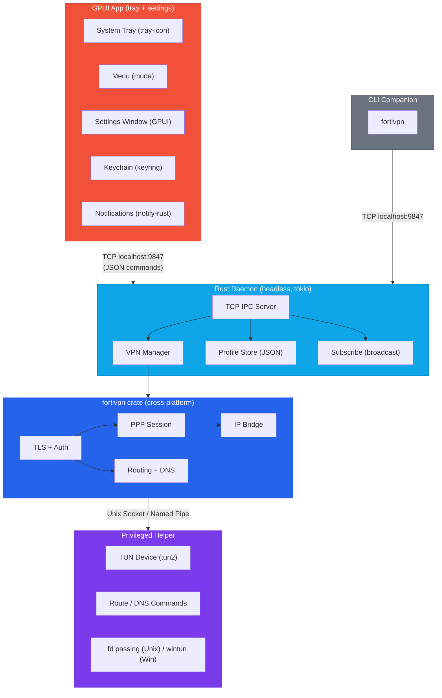
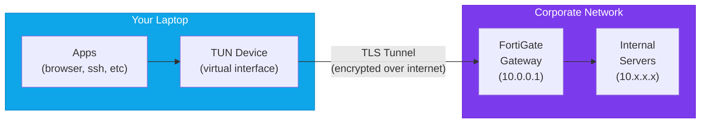

<p align="center">
  
</p>

<h1 align="center">FortiVPN Tray</h1>

<p align="center">
  A lightweight cross-platform system tray app for FortiGate SSL-VPN with password storage and CLI automation — built entirely in Rust.
</p>

<p align="center">
  
  
  
  
  <a href="https://securityscorecards.dev/viewer/?uri=github.com/ktutnik/fortivpn-tray"></a>
  
</p>

---

## Motivation

Connecting to a FortiGate SSL-VPN has three common options — all with significant friction:

- **FortiClient** doesn't store your VPN password. Every single connection requires manually typing your credentials. It's also bloated, installs kernel extensions, and runs background services you don't need.
- **openfortivpn** requires `sudo` for every connection, a config file, and terminal babysitting. No GUI, no password storage.
- **AI coding assistants** (Claude Code, Cursor, GitHub Copilot) that need VPN access to reach internal resources have no way to connect, disconnect, or check VPN status through FortiClient — there's no CLI, no API, no automation interface. You have to manually switch back to FortiClient every time the VPN drops.

FortiVPN Tray solves all three problems:

- **Stores your password securely** in the OS credential store (macOS Keychain, Windows Credential Manager, Linux Secret Service) — enter it once, connect forever
- **CLI companion** (`fortivpn connect sg`) lets AI coding assistants and scripts manage VPN connections programmatically
- **Lightweight system tray app** with near-zero battery impact — no kernel extensions, no bloat, just click to connect

## Features

- **Password storage** — enter your VPN password once, stored securely in OS keychain
- **CLI for automation** — `fortivpn connect/disconnect/status` for scripts and AI assistants
- **Cross-platform** — macOS, Windows, and Linux from a single Rust codebase
- One-click connect/disconnect from the system tray
- Near-zero battery drain when idle (no polling)
- Auto-reconnect on unexpected VPN drops (up to 3 retries)
- Native desktop notifications
- Multiple VPN profile support
- Certificate auto-fetch (SHA256 fingerprint)
- IPv6 leak prevention
- No external VPN binaries required

## Installation

### Why Build from Source?

A VPN app routes **all your network traffic** through its tunnel. You should know exactly what it does with that access. FortiVPN Tray is distributed as source code so you can audit it before trusting it.

- **Trust through transparency** — Every line of code is open for inspection. Unlike closed-source VPN clients, you can verify there's no telemetry, no data collection, no hidden network calls. Build it yourself and know exactly what's running.
- **No code signing costs** — Distributing signed binaries requires a paid Apple Developer Program ($99/year) on macOS, and an EV code signing certificate (~$300/year) on Windows. Without signing, OS gatekeepers block downloaded binaries. Building locally avoids this entirely — locally-built apps are trusted by default.
- **Reproducible** — Same source code, same build, same binary. Anyone can verify the build produces identical results.

### Prerequisites

All platforms need the [Rust toolchain](https://rustup.rs/):

```bash
curl --proto '=https' --tlsv1.2 -sSf https://sh.rustup.rs | sh
```

### Install

Clone the repo and run the install script. It auto-detects your platform:

```bash
git clone https://github.com/ktutnik/fortivpn-tray.git
cd fortivpn-tray
./install.sh
```

> **Windows**: Open **Git Bash** (installed with [Git for Windows](https://git-scm.com/download/win)) and run the commands above.

The install script will:

| | macOS | Linux | Windows |
|---|---|---|---|
| **Builds** | Rust daemon + GPUI app + helper | Rust daemon + GPUI app + helper | Rust daemon + GPUI app |
| **Installs to** | `/Applications/` | `~/.local/bin/` | `%LOCALAPPDATA%\FortiVPN Tray\` |
| **Admin required** | Yes (one-time, for helper daemon) | No | No |

### Update

```bash
git pull
./install.sh
```

### Uninstall

```bash
./uninstall.sh
```

## Usage

### System Tray

1. Launch **FortiVPN Tray**
2. Click the shield icon in the menu bar / system tray
3. Click a profile to connect — enter your VPN password when prompted
4. Click again to disconnect

### CLI

The CLI controls the VPN through the daemon via TCP. AI coding assistants, scripts, and cron jobs can manage VPN connections programmatically.

```bash
fortivpn status              # Show connection status
fortivpn list                # List profiles
fortivpn connect <name>      # Connect to a profile
fortivpn disconnect          # Disconnect
```

Short aliases: `s` = status, `l` = list, `c` = connect, `d` = disconnect

Profile matching is case-insensitive and partial — `sg` matches "My SG VPN".

### AI Coding Assistant Integration

```bash
# Check if VPN is connected before accessing internal services
fortivpn status

# Connect to VPN when needed
fortivpn connect sg

# Disconnect when done
fortivpn disconnect
```

Since passwords are stored in the OS keychain, the CLI connects without any interactive prompts — perfect for automated workflows.

## Design

### Architecture

The app follows the [Tailscale pattern](https://tailscale.com/) — separating the **UI** from the **VPN engine** into two processes that communicate over TCP IPC. Everything is written in Rust.



**Why two processes?** Battery efficiency. The GPUI app sleeps completely when idle (no windows open, `ControlFlow::Wait`). The daemon blocks on `TcpListener::accept()`. Status changes push instantly via the `subscribe` TCP channel — zero polling.

### Components

#### GPUI App (`crates/fortivpn-app/`)

Cross-platform tray app built with [GPUI](https://gpui.rs/) (GPU-accelerated UI framework from Zed editor) + `tray-icon`/`muda` for the system tray.

| File | What it does |
|------|-------------|
| `main.rs` | GPUI app init, tray icon, menu event loop |
| `ipc_client.rs` | TCP IPC client + subscribe listener |
| `keychain.rs` | OS credential store via `keyring` crate |
| `notification.rs` | Desktop notifications via `notify-rust` |

#### Daemon (`crates/fortivpn-daemon/`)

Headless Rust process (tokio async runtime). Serves IPC commands over TCP `127.0.0.1:9847`.

| File | What it does |
|------|-------------|
| `main.rs` | Entry point, logger init, IPC server start |
| `ipc.rs` | TCP server, command handlers, subscribe broadcast |
| `vpn.rs` | VPN state machine (Disconnected/Connecting/Connected/Error) |
| `profile.rs` | Profile CRUD, JSON persistence |
| `installer.rs` | Helper daemon installation (platform-specific) |

**IPC Protocol** — text-based, one command per line, one JSON response per line:
```
status                              → {"ok":true,"data":{"status":"connected","profile":"MIMS SG"}}
connect_with_password {"name":"...","password":"..."}  → {"ok":true,"message":"Connected"}
disconnect                          → {"ok":true,"message":"Disconnected"}
subscribe                           → (persistent: pushes status events as JSON lines)
get_profiles / save_profile / delete_profile  → profile CRUD
```

#### VPN Library (`crates/fortivpn/`)

Core VPN protocol implementation. Pure Rust, cross-platform (`#[cfg]` for Unix/Windows).

| File | What it does |
|------|-------------|
| `lib.rs` | `VpnSession` — 6-phase connection orchestration |
| `auth.rs` | TLS + HTTP authentication, SVPNCOOKIE, certificate pinning |
| `bridge.rs` | Async IP bridge (TUN to TLS, bidirectional) |
| `tunnel.rs` | FortiGate frame encoding (`0x5050` magic) |
| `ppp.rs` | PPP/LCP/IPCP protocol state machines |
| `routing.rs` | Route/DNS management (macOS/Linux/Windows) |
| `helper.rs` | Helper client (Unix: SCM_RIGHTS, Windows: stub) |
| `tun.rs` | TUN device creation via `tun2` |
| `async_tun.rs` | Async TUN wrapper (Unix only) |

#### Privileged Helper (`crates/fortivpn-helper/`)

Runs as root. Platform-specific startup (launchd/systemd/Windows Service), shared command handling.

| File | What it does |
|------|-------------|
| `main.rs` | Entry point, platform dispatch |
| `commands.rs` | Shared: JSON command parsing, route/DNS execution |
| `unix_main.rs` | Unix: launchd socket activation, SCM_RIGHTS fd passing |

#### CLI (`crates/fortivpn-cli/`)

Terminal companion. Reads keychain locally, sends `connect_with_password` to daemon.

```bash
fortivpn status | list | connect <name> | disconnect | set-password
```

### Key Design Decisions

- **100% Rust** — No Swift, no HTML, no WebView. Single codebase for all platforms.
- **TCP IPC** — `127.0.0.1:9847`. Works on macOS, Linux, and Windows with zero platform code. Loopback is kernel-shortcut (no network overhead).
- **Subscribe channel** — Daemon pushes status events over persistent TCP connection. UI updates instantly, zero polling.
- **Credential isolation** — UI app and CLI own all keychain access. Daemon never touches credentials.
- **Platform helpers** — Only the helper runs privileged. Shared command logic in `commands.rs`, platform startup in separate files.

### Project Structure

```
fortivpn-tray/
├── Cargo.toml                        # Workspace root
├── crates/
│   ├── fortivpn/                     # VPN protocol library (cross-platform)
│   │   ├── src/
│   │   │   ├── lib.rs               # VpnSession orchestration
│   │   │   ├── auth.rs              # TLS + HTTP authentication
│   │   │   ├── bridge.rs            # Async IP bridge
│   │   │   ├── tunnel.rs            # FortiGate frame encoding
│   │   │   ├── ppp.rs              # PPP/LCP/IPCP protocol
│   │   │   ├── routing.rs          # Route + DNS (per-platform)
│   │   │   ├── helper.rs           # Helper client
│   │   │   ├── tun.rs              # TUN device creation
│   │   │   └── async_tun.rs        # Async TUN wrapper (Unix)
│   │   └── tests/                   # Integration tests
│   ├── fortivpn-daemon/              # Headless daemon
│   │   ├── src/
│   │   │   ├── main.rs             # Entry point
│   │   │   ├── ipc.rs              # TCP IPC server
│   │   │   ├── vpn.rs              # VPN state machine
│   │   │   ├── profile.rs          # Profile storage
│   │   │   ├── installer.rs        # Helper installation
│   │   │   └── notification.rs     # No-op (clients notify)
│   │   └── build.rs                 # Helper binary build
│   ├── fortivpn-helper/              # Privileged helper (root)
│   │   └── src/
│   │       ├── main.rs             # Platform dispatch
│   │       ├── commands.rs          # Shared command handlers
│   │       └── unix_main.rs        # Unix: launchd, SCM_RIGHTS
│   ├── fortivpn-cli/                 # CLI companion
│   │   └── src/main.rs             # connect/disconnect/status
│   └── fortivpn-app/                 # GPUI tray app
│       └── src/
│           ├── main.rs             # GPUI app, tray icon
│           ├── ipc_client.rs       # TCP IPC client
│           ├── keychain.rs         # OS credential store
│           └── notification.rs     # Desktop notifications
├── resources/
│   ├── Info.plist                   # macOS bundle metadata
│   └── com.fortivpn-tray.helper.plist  # launchd config
├── icons/                            # App + tray icons
├── install.sh                        # Cross-platform install
└── uninstall.sh                      # Cross-platform uninstall
```

### Running Tests

```bash
cargo test --workspace            # Run all 270 tests
cargo test -p fortivpn            # VPN protocol tests only
cargo test -p fortivpn-daemon     # Daemon IPC tests
cargo clippy --workspace          # Lint
```

### Logging

```bash
# macOS: Console.app unified logging
log stream --predicate 'subsystem == "com.fortivpn-tray"' --level debug

# Linux/Windows: stderr
RUST_LOG=debug ./fortivpn-daemon
```

### Data Storage

| Data | Location |
|------|----------|
| Profiles | `~/Library/Application Support/fortivpn-tray/profiles.json` (macOS) |
| Passwords | OS credential store (Keychain / Credential Manager / Secret Service) |
| IPC | TCP `127.0.0.1:9847` |

## How FortiGate SSL-VPN Works

### What is FortiGate SSL-VPN?

FortiGate is a network security appliance made by Fortinet. Organizations deploy it at the edge of their corporate network as a firewall and VPN gateway. The **SSL-VPN** feature allows remote employees to securely access the internal corporate network over the internet using TLS (the same encryption that protects HTTPS websites).

Unlike IPsec VPNs which operate at the network layer and require special firewall rules, SSL-VPN runs over standard HTTPS (port 443 by default), making it work through almost any firewall or NAT — including hotel Wi-Fi, airport networks, and restrictive corporate proxies.

### The Big Picture



When connected, your laptop gets a **virtual IP address** on the corporate network (e.g., `10.212.134.5`). All traffic destined for the corporate network is routed through a **TUN device** (a virtual network interface), encrypted via TLS, and sent to the FortiGate gateway which decrypts it and forwards it to the internal servers. Responses travel the same path back.

### Connection Phases

1. **TLS Authentication** — Connect to gateway over TLS, POST credentials, receive `SVPNCOOKIE` + XML config (routes, DNS, assigned IP)
2. **TUN Device** — Privileged helper creates TUN, passes fd back via SCM_RIGHTS (Unix) or wintun (Windows)
3. **PPP Negotiation** — LCP (link parameters) + IPCP (IP assignment) over FortiGate's proprietary `0x5050` framing
4. **IP Bridge** — Async bidirectional copy: TUN to TLS (outbound) and TLS to TUN (inbound), with LCP echo keep-alive
5. **Routing** — Configure OS routing table (split or full tunnel) + DNS via helper
6. **Disconnect** — Tear down routes/DNS, restore IPv6, send HTTP logout, close TLS

### Security Model

| Layer | Protection |
|-------|-----------|
| **Transport** | TLS 1.2/1.3 encrypts all tunnel traffic |
| **Authentication** | Username + password over TLS (no plaintext) |
| **Certificate pinning** | Optional SHA256 fingerprint verification prevents MITM |
| **Credential storage** | OS keychain (hardware-backed on Apple Silicon) |
| **Privilege separation** | Only the helper runs as root |
| **IPv6 leak prevention** | IPv6 disabled during VPN to prevent traffic bypass |

## License

MIT
