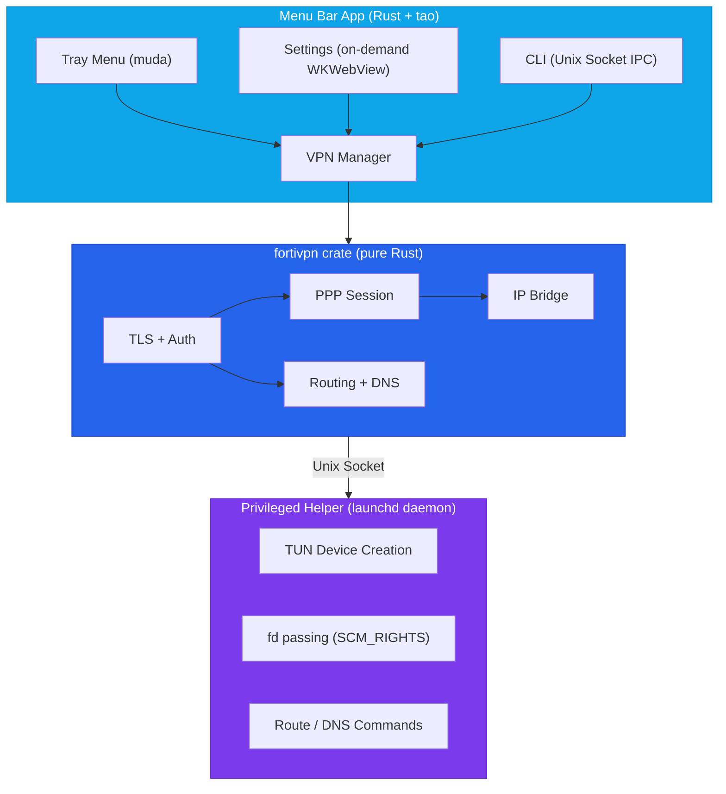

<p align="center">
  
</p>

<h1 align="center">FortiVPN Tray</h1>

<p align="center">
  A lightweight macOS system tray app for FortiGate SSL-VPN — built natively in Rust.
</p>

<p align="center">
  
  
  
</p>

---

## Motivation

Connecting to a FortiGate SSL-VPN usually means either running the heavy FortiClient app or wrestling with `openfortivpn` in the terminal with `sudo`. Both have friction:

- **FortiClient** is bloated, installs kernel extensions, and runs background services you don't need.
- **openfortivpn** requires `sudo` for every connection, a config file, and terminal babysitting.

FortiVPN Tray takes a different approach — a **lightweight system tray app** that implements the FortiGate SSL-VPN protocol natively in Rust. No subprocess wrapping, no kernel extensions, no bloat. Just click to connect.

## Design

### Architecture



### Key Design Decisions

- **Native Rust protocol implementation** — TLS, HTTP auth, PPP framing, and IP bridging are all implemented from scratch. No dependency on `openfortivpn` or any external VPN binary.

- **No framework overhead** — Uses `tao` for the macOS event loop and `tray-icon`/`muda` for the system tray. No Electron, no Tauri, no WebKit process running in the background. Near-zero battery drain when idle.

- **On-demand settings UI** — Settings window uses WKWebView loaded only when opened. WebKit is not running when settings is closed.

- **Privilege separation** — Only the helper process runs with elevated privileges (as a launchd daemon). It creates the TUN device and passes the file descriptor back via `SCM_RIGHTS`. The main app stays unprivileged.

- **Persistent helper** — The privileged helper is managed by launchd with socket activation. No repeated admin password prompts — install once, connect forever.

- **IPv6 leak prevention** — Automatically disables IPv6 on active interfaces when the VPN connects to prevent traffic leaking outside the tunnel, and restores it on disconnect.

- **Secure credential storage** — VPN passwords are stored in macOS Keychain, never on disk.

### Workspace Structure

```
src/
├── src/
│   ├── main.rs            # App entry point (tao event loop, tray icon)
│   ├── app.rs             # Shared state, tray menu, connect/disconnect handlers
│   ├── settings_webview.rs # On-demand WKWebView settings window
│   ├── native_ui.rs       # Native NSAlert password prompt
│   ├── notification.rs    # Desktop notifications (notify-rust)
│   ├── vpn.rs             # VPN connection lifecycle
│   ├── profile.rs         # Profile CRUD, JSON persistence
│   ├── keychain.rs        # macOS Keychain read/write/delete
│   ├── ipc.rs             # Unix socket IPC server for CLI
│   └── installer.rs       # Helper daemon installation
├── crates/
│   ├── fortivpn/          # Core VPN library (protocol, auth, tunneling)
│   ├── fortivpn-helper/   # Privileged helper binary (TUN + routing)
│   └── fortivpn-cli/      # CLI companion tool
├── resources/
│   ├── settings/index.html # Settings UI (HTML/CSS/JS)
│   ├── Info.plist          # macOS app bundle metadata
│   └── com.fortivpn-tray.helper.plist # launchd daemon config
├── scripts/
│   └── bundle-app.sh      # Create .app bundle from release build
└── icons/                  # App and tray icons
```

## Features

- One-click connect/disconnect from the system tray
- Near-zero battery drain when idle (no background WebKit)
- Multiple VPN profile support
- Settings UI with macOS dark mode support
- Native password prompt on first connect
- CLI companion for terminal workflows
- Secure credential storage (macOS Keychain)
- Native desktop notifications
- IPv6 leak prevention
- No external VPN binaries required

## Prerequisites

- [Rust toolchain](https://rustup.rs/)

```bash
curl --proto '=https' --tlsv1.2 -sSf https://sh.rustup.rs | sh
```

## Build

```bash
cd src
cargo build --release
bash scripts/bundle-app.sh
```

This produces:
- `target/release/bundle/FortiVPN Tray.app` — the macOS app bundle
- `target/release/fortivpn` — the CLI companion

### Install

```bash
# Copy app to Applications
cp -r "target/release/bundle/FortiVPN Tray.app" /Applications/

# Install privileged helper daemon
sudo bash -c '
cp target/release/fortivpn-helper /Library/PrivilegedHelperTools/fortivpn-helper &&
chmod 755 /Library/PrivilegedHelperTools/fortivpn-helper &&
chown root:wheel /Library/PrivilegedHelperTools/fortivpn-helper &&
cp resources/com.fortivpn-tray.helper.plist /Library/LaunchDaemons/ &&
chown root:wheel /Library/LaunchDaemons/com.fortivpn-tray.helper.plist &&
launchctl bootout system /Library/LaunchDaemons/com.fortivpn-tray.helper.plist 2>/dev/null;
launchctl bootstrap system /Library/LaunchDaemons/com.fortivpn-tray.helper.plist
'
```

## Usage

### System Tray

1. Launch **FortiVPN Tray** from Applications
2. Click the shield icon in the menu bar
3. Open **Settings** to add a VPN profile (host, port, username, certificate fingerprint)
4. Click a profile to connect — enter your VPN password when prompted
5. Click again to disconnect

### CLI

The CLI controls the VPN through the tray app via a Unix socket.

```bash
fortivpn status              # Show connection status
fortivpn list                # List profiles
fortivpn connect <name>      # Connect to a profile
fortivpn disconnect          # Disconnect
```

Short aliases: `s` = status, `l` = list, `c` = connect, `d` = disconnect

Profile matching is case-insensitive and partial — `sg` matches "My SG VPN".

> The tray app must be running for the CLI to work.

## Data Storage

| Data | Location |
|------|----------|
| Profiles | `~/Library/Application Support/fortivpn-tray/profiles.json` |
| Passwords | macOS Keychain (service: `fortivpn-tray`) |
| IPC Socket | `~/.config/fortivpn-tray/ipc.sock` |

## How It Works

1. **Authentication** — Connects to the FortiGate gateway over TLS, authenticates via HTTP POST, and obtains an `SVPNCOOKIE`.
2. **Tunnel setup** — The privileged helper creates a TUN device and passes the file descriptor to the main app via `SCM_RIGHTS`.
3. **PPP session** — Establishes a PPP session over the TLS connection to negotiate IP configuration.
4. **IP bridge** — Bridges packets between the TUN device and the PPP/TLS tunnel using async I/O.
5. **Routing** — Configures routes and DNS through the helper process, disables IPv6 to prevent leaks.
6. **Disconnect** — Tears down routes/DNS, restores IPv6, and closes the TLS session. The helper stays alive for the next connection.

## License

MIT
